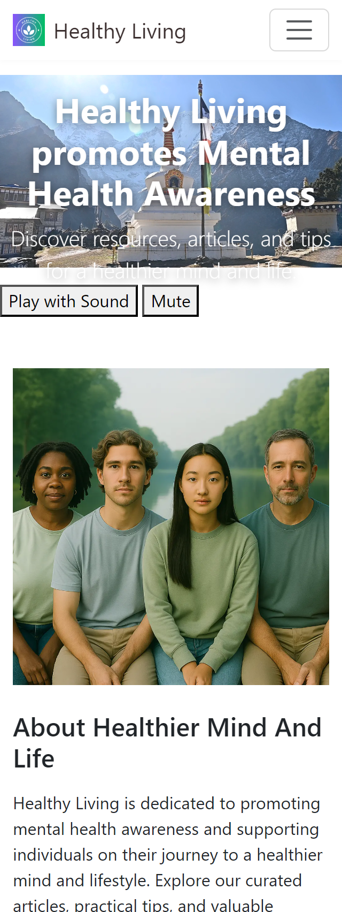
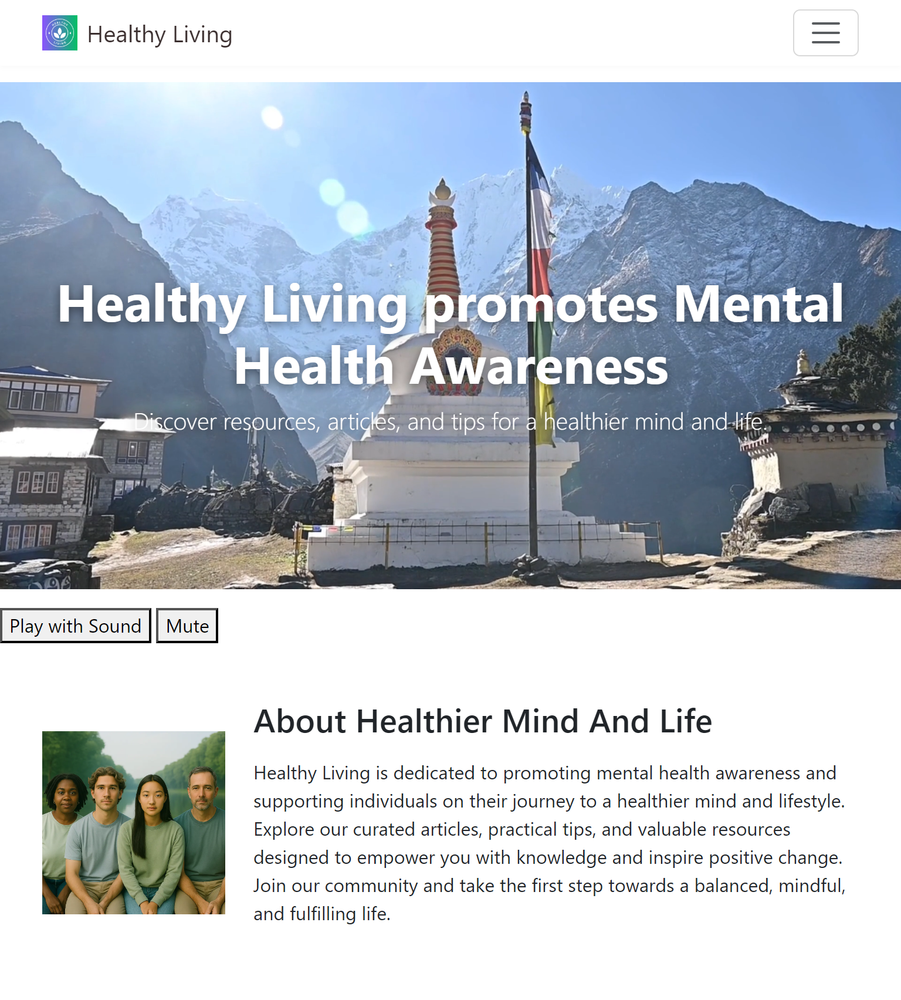

# Portfolio Project 1 - Healthy Living promotes Mental Health Awareness

This website has been created to fulfill the project brief for Code Institute's first individual assessment.
The live link can be found here: [Healthy Living promotes Mental Health Awareness](https://marso22.github.io/healthy-living-mental-health/#)

# Description

'Healthy Living promotes Mental Health Awareness' is a fully responsive static HTML (style section is included into index.html <head> section) website designed to promote mental health awareness and support individuals on their journey to a healthier mind and lifestyle.

## Here is mobile view:                  Tablet view:                                          laptop view:
    

tabletscreenshot.png 
laptopscreenshot.png
largemonitorscreenshot.png

# Wireframes
Before starting the project, a couple of basic wireframes were created to visualize the final product. Both mobile and desktop wireframes were developed.
 
 wireframe for desktop - screenshot

 wireframe for mobile - screenshot

