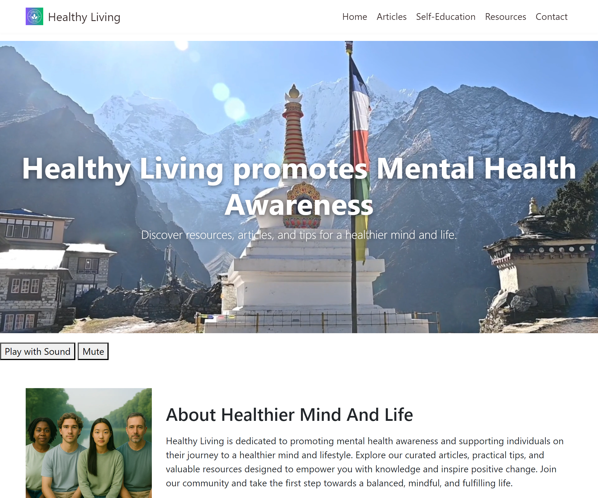

# Portfolio Project 1 - Healthy Living promotes Mental Health Awareness

This website has been created to fulfill the project brief for Code Institute's first individual assessment.
The live link can be found here: [Healthy Living promotes Mental Health Awareness](https://marso22.github.io/healthy-living-mental-health/#)

# Description

- 'Healthy Living promotes Mental Health Awareness' is a fully responsive static HTML (style section is included into index.html <head> section) website designed to promote mental health awareness and support individuals on their journey to a healthier mind and lifestyle.
- User seeks accessible, beginner-friendly information on mental health, including how to recognize common issues and manage stress, presented in a supportive and organised layout.
- I wanted to create a welcoming webpage that provides basic mental health information using a clean and supportive design. The focus is on using HTML and CSS with Bootstrap to create a calming and well-organised user experience.

### Here is Mobile, Tablet, Laptop and Large Monitor view:
     

# Wireframes
Before starting the project, a couple of basic wireframes were created to visualize the final product. Both mobile and desktop wireframes were developed.
 
 wireframe for desktop - screenshot

https://ui.dev/amiresponsive?url=https://marso22.github.io/healthy-living-mental-health/#

 wireframe for mobile - screenshot

# How AI Was Used

Artificial Intelligence played a significant role in the development of this project. Here are some ways how AI was used:

## Code Generation

AI tools like GitHub Copilot and ChatGPT were used to generate code snippets for various parts of the website. The AI provided context-aware suggestions that helped streamline the coding process and reduce development time.

## Image Generation

DALL-E, an AI model developed by OpenAI, was used to generate the images for the website.
Canva image library and online graphic design tool was used creating some images too. 
Invideo video editing tool used for Hero video design.

## Content Assistance

AI tools like GitHub Copilot and ChatGPT were used to assist in writing code and creating content for the website. These tools provided suggestions and auto-completions, which sped up the development process and ensured high-quality code.

## Accessibility Improvements

AI was used to analyze the website's accessibility features. Tools like Lighthouse provided insights into how accessible the website is for users with disabilities and suggested improvements to enhance user experience.
By leveraging AI, the project was able to achieve a higher level of efficiency, creativity, and accessibility.

# Website Deployment

First of all user stories were described and Project Plan created accordingly.
Then Colour Palette designed manually. The website uses shades of blue, often associated with trust, safety and green, often associated with helthy living.

Next step was to outline shape of one-page website using wireframes.

Then opened empty index.html and started to code using GitHub Copilot. During implementation used aquired experience from previous projects on LMS - Boardwalk Games, Sevenseas Spa. For Starting Hero section decided to use video with audio track. It starts automatically when site is opened. Audio has to be turned on if wanted. There is an option to Mute it later. To enable video and audio feature ChatGPT AI suggested to use JS script. Navbar was fixed at the top and visible all the time when scrolling to make easy and comfortable use of content. Navbar links let jump to specific section. At the end user can fill in contact form and join community of people with similar aspirations.

# Testing

## Code Validation

HTML code was validated using the W3C Markup Validation Service. No errors found. Style section is within index.html.

## Lighthouse Testing

Lighthouse was used to test the performance, accessibility, best practices, and SEO of the website. The results are as follows:

Index.html: - Performance impacted by image sizes (even after optimized by Squoosh.app) and internet speed which is only 45 Mbps.
Best Practices result might be impacted by third party programs involved in some parts of website deployment.

Deployed site can be found [here](https://marso22.github.io/healthy-living-mental-health/#)

# Credits

## Content

The content for this website was created by
- GitHub Copilot
- On LMS available material
- ChatGPT providing publicly available information

## Media

Images used in this project were generated using DALL-E and taken from Canva library with permission.
Hero video made with Invideo video editing tool for which I have subscription.
